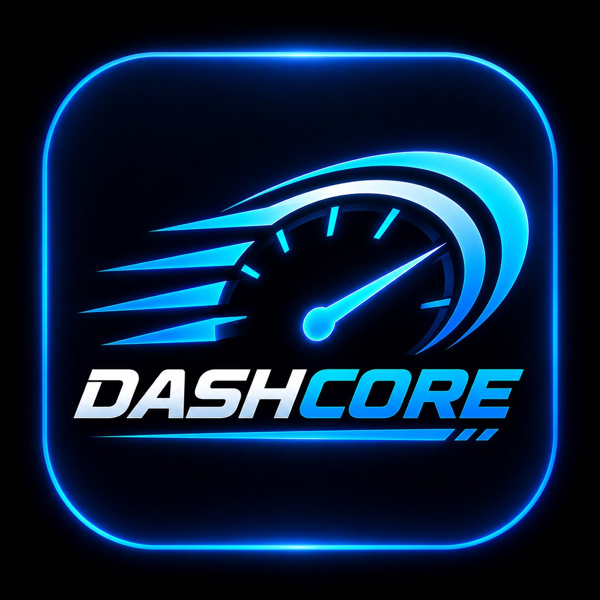
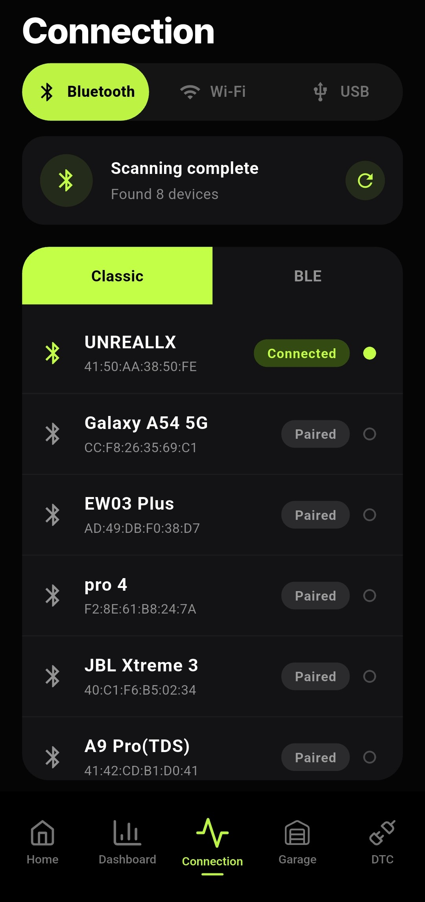

\# DashCore


\*\*DashCore\*\* is an open-source Android automotive dashboard focused on \*\*OBD2 vehicle telemetry and diagnostics\*\*.


The project is designed to provide a modern, customizable and easy-to-use dashboard for displaying real-time vehicle information through compatible OBD2 adapters.


\## Features


\* OBD2 connectivity

\* Real-time vehicle telemetry

\* Engine RPM

\* Vehicle speed

\* Coolant temperature

\* Battery voltage

\* Customizable dashboard interface

\* Multiple dashboard visual styles

\* Dark interface designed for in-vehicle use

\* Diagnostic and connection monitoring


\## OBD2 Compatibility


DashCore is designed to work with \*\*ELM327-compatible OBD2 adapters\*\*.


Adapter compatibility may vary depending on the hardware, firmware and connection method used.


\## Screenshots


<p align="center">

&#x20; 

&#x20; 

</p>


\## Installation


Download the latest available Android APK from the \*\*Releases\*\* section of this repository.


Install the APK on a compatible Android device and launch DashCore.


\## Building From Source


\### Requirements


\* Flutter SDK

\* Android SDK

\* Android build tools

\* Android device or emulator


\### Clone the repository


```bash

git clone <repository-url>


cd DashCore

```


\### Build the Android application


The Android application is built from the `android` directory:


```bash

cd android

```


Then use the appropriate Flutter/Gradle build command for your development environment.


\## Project Structure


```text

DashCore/

├── android/        # Android configuration and build files

├── assets/         # Application assets

├── docs/           # Project documentation and screenshots

├── ios/             # iOS project files

├── lib/             # Flutter application source code

├── test/            # Tests

└── web/             # Web project files

```


\## Development Status


DashCore is currently under active development.


Features, OBD2 compatibility and dashboard functionality may change as the project evolves.


\## Roadmap


Future development will focus on improving:


\* OBD2 connection stability

\* Telemetry reliability

\* Dashboard customization

\* Vehicle data visualization

\* Diagnostic functionality

\* Android automotive experience


\## License


This project is open source. See the `LICENSE` file for details.


